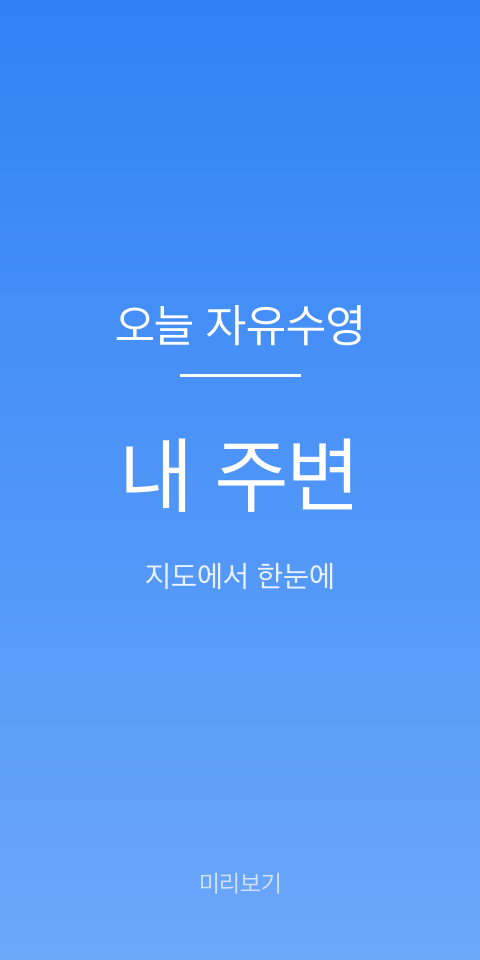
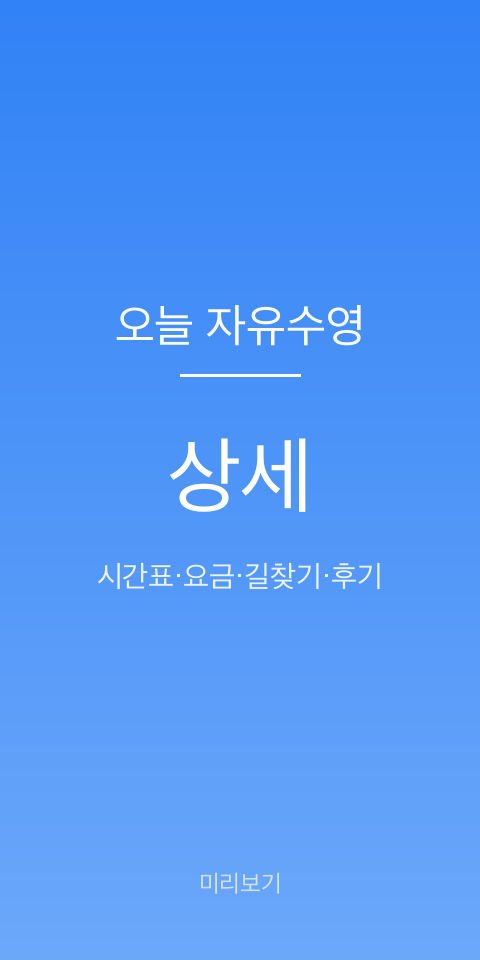

<div align="center">

# 🏊 오늘 자유수영 (Openswim)

**공공 수영장 자유수영 시간을 한눈에** — 오늘 어디서 수영할지 지역·내 위치 기반으로 찾는 [AppsInToss](https://apps-in-toss.toss.im/) 미니앱

</div>

## 미리보기

<p align="center">
  &nbsp;
  &nbsp;
  
</p>

> 위 이미지는 브랜드 미리보기예요. 실제 스크린샷을 `docs/preview/{home,nearby,detail}.png` 로 교체하면 자동으로 반영됩니다.

## 주요 기능

- 📍 **지역·내 위치 기반 검색** — 구 단위 지역 검색(엔터 시 지역 우선 매칭), 위치 권한이 있으면 가까운 순, 없으면 금천구 기본 정렬
- 🗓️ **오늘/토/일 · 공휴일 운영 판별** — 요일별 자유수영 시간표 + 공휴일 처리(운영 / 휴무 / 정보 없음)
- 🗺️ **지도** — 카카오맵에 전체 수영장 마커, 검색하면 해당 지역으로 이동, 카카오맵·네이버 길찾기
- ⭐ **즐겨찾기**, 상세 실제 요금표 등

## 기술 스택

| 구분 | 사용 |
|------|------|
| 프론트 | React 18 · TypeScript · Vite |
| 플랫폼 | AppsInToss `@apps-in-toss/web-framework` 3.x (Granite/AIT) · TDS `@toss/tds-mobile` |
| 데이터 | Neon Data API(REST, 익명 토큰) 우선 조회 + 번들 JSON(`src/data/pools.json`) 장애 폴백 |
| 지도 | Kakao Maps JS SDK |

## 시작하기

```bash
# 1) 의존성 설치
npm install

# 2) 환경 변수 — .env 생성 (.env.example 참고)
#    VITE_KAKAO_JS_KEY / VITE_NEON_DATA_API_URL / VITE_NEON_AUTH_URL
#    (VITE_* 값은 클라이언트 번들에 포함되므로 공개 가능한 값만 넣는다.
#     DB 연결 문자열·관리자 API 키는 여기 넣지 않는다.)

# 3) 개발 서버
npm run dev

# 4) 빌드 (AIT 아티팩트 openswim.ait 생성)
npm run build
```

> 원격 조회가 실패하면(네트워크 문제, Neon 장애 등) 앱은 자동으로 번들된 `src/data/pools.json`을 사용합니다. 데이터 갱신 스크립트는 `scripts/`에 있고, 최신 데이터를 Neon에 반영하려면 `.manus/neon-migration/migrate_pools_to_neon.mjs`(환경변수 `NEON_DATABASE_URL` 필요)를 사용합니다.

> 카카오맵은 사용 도메인을 카카오 콘솔 `[플랫폼 > Web]` 에 등록해야 표시됩니다. (`localhost:5173`, 배포 도메인 등)

## 프로젝트 구조

```
src/
  screens/     홈 · 내 주변(지도) · 즐겨찾기 · 상세
  components/  SearchBox · PoolList · PoolMap · FavStar …
  lib/         pools(운영·공휴일 상태) · search(지역 검색) · geo · holidays …
  design/      tokens · primitives (토스풍 디자인 시스템)
  data/        pools.json (번들 폴백 데이터)
scripts/       데이터 수집·정규화·감사·Neon 동기화
supabase/      과거 스키마 이력 (런타임 미사용, Neon 이관 전 기록)
docs/          앱인토스·TDS 참고 문서, 데이터 감사 리포트, preview 이미지
```

## 데이터 관리

수영장 데이터는 `src/data/pools.json` 이 원본이고, 이걸 Neon 으로 밀어서 서비스한다.

```bash
# 1) 자동 수집 (공개 수영장 정보 서비스에서 빈 칸 보강)
node scripts/enrich-free-swim-from-helloswim.mjs --refresh --write
node scripts/enrich-free-swim-from-oneul.mjs --refresh --write
node scripts/enrich-free-swim-from-swimmingis.mjs --refresh --write

# 2) 수동 조사 결과 반영 (조사한 JSON 배치 파일을 검증해서 병합)
node scripts/apply-researched-free-swim.mjs <batch.json> [...] --write

# 3) 정규화 (문자열 요일 → 숫자, 겹치는 세션 병합)
node scripts/normalize-free-swim-days.mjs --write
node scripts/merge-free-swim-sessions.mjs --write

# 4) 감사 (docs/data/*.json 으로 리포트 생성)
node scripts/audit-pools-data.mjs
node scripts/audit-pools-quality.mjs
node scripts/report-pool-data-coverage.mjs

# 5) Neon 반영 (.env 의 NEON_DATABASE_URL 필요)
set -a; source .env; set +a
node scripts/sync-pools-to-neon.mjs
```

`free_swim` 스키마는 `day` 가 `0=일 … 6=토`, `7=공휴일` 이고, 각 요일은 `sessions: [{ start, end }]` 를 갖는다. 세션이 빈 배열이면 “그날 휴무” 를 뜻한다.

## 링크

- [앱인토스 콘솔](https://apps-in-toss.toss.im/), [개발자센터](https://developers-apps-in-toss.toss.im/), [개발자 커뮤니티](https://techchat-apps-in-toss.toss.im/)

## 만든 사람

- [0rigin.space](https://0rigin.space)
